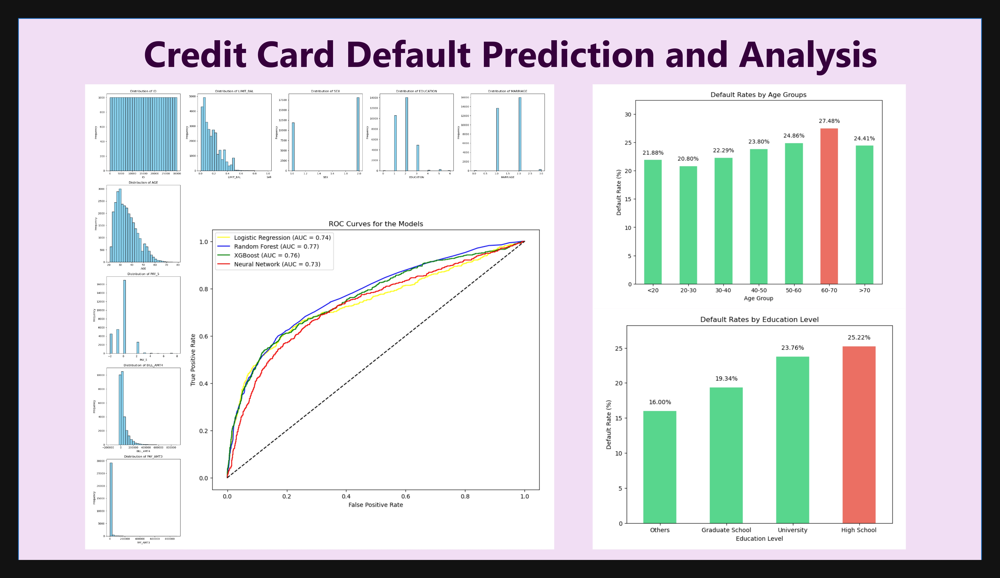

# Credit Card Default Prediction and Analysis

---

---

### Tools/Skills Used:

---

### Objective:

Develop a model to predict the likelihood of credit card default among customers, using historical data on customer transactions, credit history, and demographics using the UCI Credit Card Default Dataset. The project aims to understand default patterns and reduce financial risk for credit institutions through data-driven insights and predictive analytics.

---

## Methodology:

### 1. **Data Collection and Extraction**

- **Skills/Tools:** Python (pandas, requests)
- **Description:**
  - Sourced a financial dataset, namely the **UCI Credit Card Default dataset**.
  - Used Python to load, structure, and prepare the data effectively.
  - Ensured data integrity and readiness for preprocessing.
  - Ensured data security and compliance with financial data handling guidelines.

### 2. **Data Cleaning and Preparation**

- **Skills/Tools:** Python (pandas, NumPy)
- **Description:**
  - Handled missing values.
  - Removed outliers using statistical methods (Z-scores and IQR).
  - Standardized continuous variables (e.g., income, age, credit balance) to improve model performance.
  - Encoded categorical variables such as education level and marital status.
  - Transformed skewed distributions using logarithmic and Box-Cox transformations.

### 3. **Data Analysis and Exploration**

- **Skills/Tools:** Python (pandas, scipy, statsmodels)
- **Description:**
  - Conducted exploratory data analysis (EDA) to identify key factors influencing credit defaults.
  - Performed statistical tests to explore correlations between variables such as credit balance, payment history, and demographics.
  - Generated summary statistics and presented initial insights to inform the visualization and modeling phases.

### 4. **Data Visualization**

- **Skills/Tools:** Python (matplotlib, seaborn)
- **Description:**
  - Created visualizations that highlight trends and insights, such as default rates by age group, and education background.
  - Used Python libraries to generate visualizations for static reports or presentations.

### 5. **Machine Learning and Predictive Analytics**

- **Skills/Tools:** Python (scikit-learn)
- **Description:**
  - Developed classification models (logistic regression, random forest, XGBoost, and neural network) to predict defaults.
  - Performed feature engineering, including scaling, and feature selection.
  - Split the dataset into training and testing sets for model validation.
  - Evaluated model performance using metrics like precision, recall, F1 score, ROC-AUC, and accuracy.
  - Optimized the models through hyperparameter tuning and cross-validation.

### 6. **Communication and Reporting**

- **Skills/Tools:** Jupyter Notebook
- **Description:**
  - Summarized insights, methodology, and results in a clear and concise manner.
  - Used Jupyter Notebook to document the analysis, with markdown cells explaining the workflow and code.

---

### Key Findings and Results:

|Model|Best ROC-AUC Score|
|----------|-------------:|
|Random Forest|0.77|
|XGBoost|0.76|
|Logistic Regression|0.74|
|Neural Network|0.73|   

 

---

#### Insights:
- **Default Rates by Age Group:**
  - Higher default rates observed in older age groups (50-70).
  - Suggests potential focus on financial support programs for older demographics.
  
  

- **Default Rates by Education Level:**
  - Individuals with "High School" education showed the highest default rates.
  - Tailored financial literacy programs could mitigate risks.
  
  

- **Feature Importance:**
  - Payment history variables (e.g., `PAY_0`, `PAY_2`) and `LIMIT_BAL` are among the top predictors of default risk.

- **Business Insights:**
  - Focus on early intervention strategies for high-risk demographics (e.g., older individuals, lower education levels).
  - Leverage predictive models to enhance credit risk assessments during loan approvals.

- **Future Enhancements:**
  - Explore additional data sources to include variables like employment status and income fluctuations.
  - Incorporate explainability tools (e.g., SHAP) to improve transparency for stakeholders.

---

## Dataset References:

[UCI Credit Card Default Dataset](https://archive.ics.uci.edu/ml/machine-learning-databases/00350/default%20of%20credit%20card%20clients.xls)

---

## Author:   

#### [Akash Kumar Kondaparthi](https://github.com/AkashKK25)
